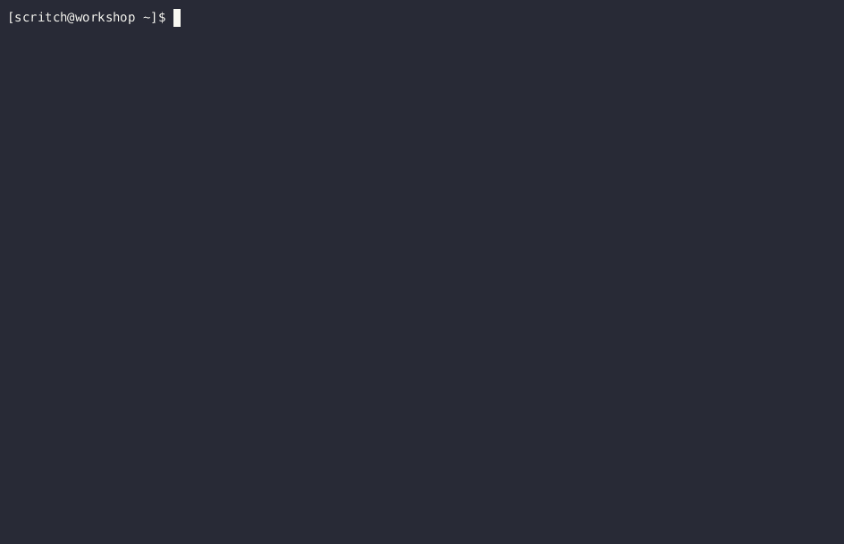

# Atari 2600 ROM Template Project

[![License][repo_license_img]](LICENSE)
[![ca65][lang_img]](https://cc65.github.io/doc/ca65.html)
[![Support][support_img]](https://www.buymeacoffee.com/owlcreekworkshop)

This is a [kickstart](https://github.com/Keats/kickstart) template project designed to help you build Atari 2600 ROMs using the ca65 assembler and CMake build system. It provides a basic structure and configuration to get you started quickly in developing your own games or applications for the classic Atari 2600 console.

## Table of Contents

- [Features](#features)
- [Layout](#layout)
- [Getting Started](#getting-started)
  - [Prerequisites](#prerequisites)
  - [Usage](#usage)
- [Contributing](#contributing)
- [License](#license)
- [Acknowledgments](#acknowledgments)
- [Support](#support)

## Features

- Basic project structure for organizing your Atari 2600 source code and assets.
- CMake toolchain for the ca65 assembler.
- 2K and 4K ROM linker configuration options.
- NTSC or PAL kernel options.

## Layout

The project structure is designed to help organize your source code and facilitate the build process using the ca65 assembler and CMake build system.

```
.
├── build/
├── src/
│   └── main.asm
├── a26.ld65.cfg
├── a26.toolchain.cmake
└── CMakeLists.txt
```

### build

The `build` directory is used by the build system to store the intermediate and final output files generated during the build process. When you run CMake and `make`, the build artifacts such as object files and the final ROM will be created in this directory.

### src

The `src` directory contains the program source code. 

### main.asm

`main.asm` is a simple starter program that performs basic machine initialization, sets up the timing for the selected video format, and renders "color bars" to the screen.

### a26.ld65.cfg

The `a26.ld65.cfg` file is the ld65 memory map configuration file used to define the memory layout of your ROM. It determines how different sections of your code and data are placed in the final ROM image.

### a26.toolchain.cmake

The `a26.toolchain.cmake` file is a CMake toolchain configuration that specifies how to compile your code using the ca65 assembler and link it using ld65. 

### CMakeLists.txt

The `CMakeLists.txt` file is the main CMake configuration file for the project. You will need to modify this file if you add new assembly source files or if you want to customize the build process.

## Getting Started

The instructions in this section will guide you through the steps required to use this project template.

### Prerequisites

You will need the following tools:

- [kickstart](https://github.com/Keats/kickstart/releases) (version 0.3.0 or higher) 

- [CMake](https://cmake.org/download/) (version 3.13 or higher)

- [ca65](https://cc65.github.io/getting-started.html) (Part of the cc65 suite)

- An Atari 2600 emulator (e.g., [Stella](https://stella-emu.github.io/downloads.html)) to test your ROMs

### Usage

<p align="center">

</p>

1. Use the `kickstart` utility to start the project generation process:

```bash
kickstart https://github.com/owlcreekworkshop/a26-kickstart
```

2. The utility will prompt you to set your project name, ROM size, and video format. Provide the necessary inputs to continue.

3. Move into the generated project build directory:

```bash
cd <project-name>/build
```

4. Generate build system files using CMake:

```bash
cmake ..
```

5. Build the ROM:

```bash
make
```

That's it! 

You should have successfully built the starter template, resulting in a ROM file named `<project-name>.a26` located in the `build` directory. You can now test it using your preferred Atari 2600 emulator and start adding your game logic or application code to `main.asm`. 

## Contributing

Contributions to this project are welcomed! If you have any ideas, bug fixes, or improvements, please feel free to open an issue. 

Please read [CONTRIBUTING.md](CONTRIBUTING.md) for details on the recommended process for submitting pull requests.

## License

This project is licensed under the [MIT License](LICENSE).

## Acknowledgments

- The "2600 Programming for Newbies" series by 
Andrew Davie: https://forums.atariage.com/topic/47479-atari-programming-workshop-chapter-links/

- The "Let's Make a Game" series by SpiceWare. Specifically the section on timers: https://forums.atariage.com/blogs/entry/11112-step-2-timers/

- Thanks to the entire Atari community for their passion and dedication to preserving history.

## Support

If you've found my work useful and would like to show your appreciation, the simplest way to do so is by giving this repository a star! It means a lot to me.

If this work has made a significant impact on your projects and you'd like to contribute monetarily, you can also treat me to a coffee.

<a href="https://www.buymeacoffee.com/owlcreekworkshop" target="_blank">
    
</a>


[lang_img]: https://badgen.net/static/ca65/6502
[repo_license_img]: https://badgen.net/static/License/MIT/red
[support_img]: https://badgen.net/static/Support/Buy%20Me%20a%20Coffee/yellow?icon=buymeacoffee&label
